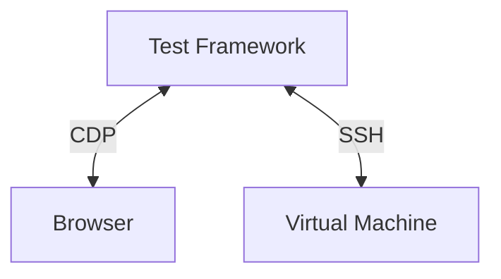
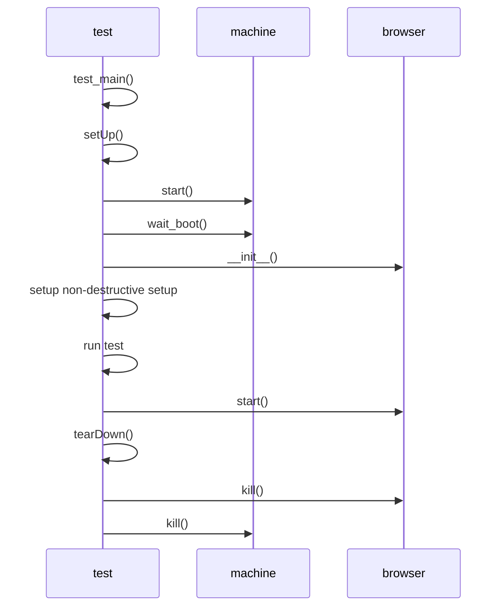
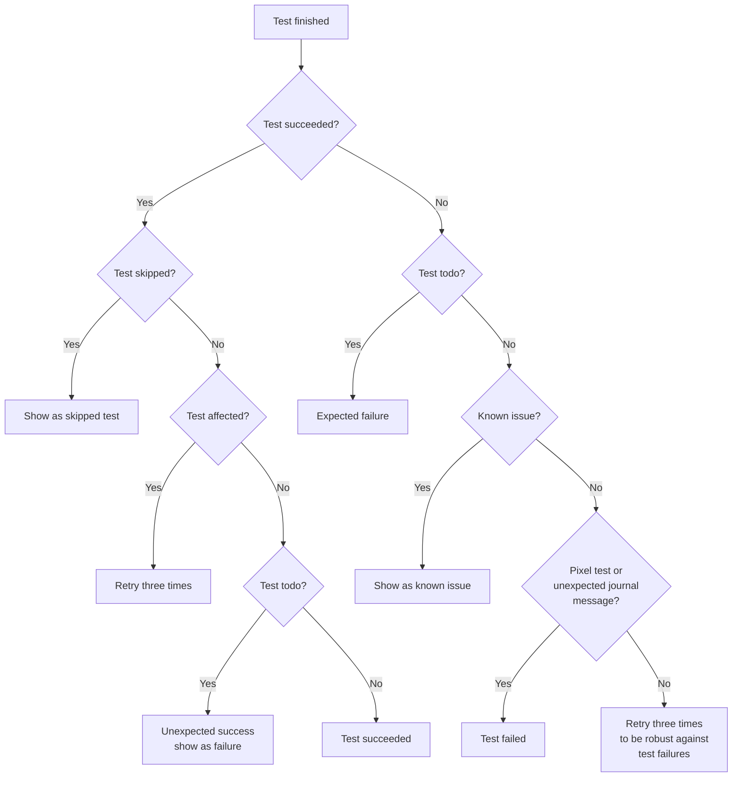

# Architecture

This document describes the architecture of Cockpit's browser integration
tests. The tests should replicate how a normal user interacts with Cockpit this
requires a test machine which can easily add have multiple disks or interfaces,
reboot, interact with multiple machines on the same network and run potentially
destructive test scenario's (e.g. installing/updating packages, formatting
disks).

For these reasons, Cockpit tests run inside a virtual machine (VM). The virtual
machine uses Cockpit specific virtual machine images maintained and created in
the [bots](https://github.com/cockpit-project/bots) repository. The images are
usually based on a distribution's cloud image customized with:

* A well-known password for the admin/root user
* Test SSH keys for access
* Test packages required to test Cockpit
* A build chroot with Cockpit's build dependencies to build the to be tested
  Cockpit source inside the virtual machine offline. This allows a developer on
  Fedora to easily prepare a Debian test image without having to install Debian
  build tools.
* Disabling system services which interfere with testing

To replicate a user, Cockpit is tested in a browser controlled using the
[Chrome DevTools Protocol](https://chromedevtools.github.io/devtools-protocol/)
(CDP) which is supported by Firefox and Chromium based browsers.

The Python test framework in `test/common` is responsible for setting up the
test environment, running tests and reporting of the test output.

Diagram of the interaction of Browser/Machine/CDP/Test Framework.


## Integration Test

Cockpit's tests can be run via three different entry points:

* `test/verify/check-$page` - run a single or multiple unit test(s)
* `test/common/run-tests` - run tests through our test scheduler (retries, tracks naughties)
* `test/run` - run tests in Continuous Integration (CI)

We will start with how a single integration test is run and then explore the test
scheduler and CI setup. The base of a Cockpit integration test looks as following:

```python
class TestApps(testlib.MachineCase):
    def testBasic(self):
        self.machine.execute("rm /usr/share/cockpit/apps")
        self.browser.login_and_go("/apps")
        self.browser.wait_not_visible("#apps")

if __name__ == '__main__':
    testlib.test_main()
```

In Cockpit there are two types of tests, `destructive` and `nondestructive`
tests. Destructive tests do something to test virtual machine which makes it
unable to run another test afterwards or requires another virtual machine for
testing. The test above is a `destructive` test which is the default, a non
`destructive` test makes sure any destructive action is restored after the test
has run as can be seen below. `nondestructive` tests where introduced to speed
up testing, as rebooting and shutting down a machine for every tests incurs a
significant penalty of ~ 10-30 seconds per test.

```python
@testlib.nondestructive
class TestApps(testlib.MachineCase):
    def testBasic(self):
        self.restore_dir("/usr/share/cockpit/apps")
        self.machine.execute("rm /usr/share/cockpit/apps")
        self.browser.login_and_go("/apps")
        self.browser.wait_not_visible("#apps")

if __name__ == '__main__':
    testlib.test_main()
```

The test above would be invoked via `./test/verify/check-apps TestApps.testBasic`
and would execute as can be seen in the diagram below:


A test starts by calling `test_main`, this provides common command line
arguments for debugging and to optionally run a test on a different
machine/browser. These arguments are available in the `MachineCase` class as
`opts`. `test_main` also takes care of instantiating a `TapRunner` which runs
all the specified tests sequentially.

Once a test is started it runs `MachineCase.setUp` which has the responsibility
to start a virtual machines(s) depending on if it is a `nondestrcutive` or
`destructive` test. If we run a `nondestructive` test a global machine is
created, and re-used for other `nondestructive` tests which might run. For
`destructive` tests a machine is created on-demand, possible multiple machines
depending on the test class `provision` variable.

 For `nondestructive` tests cleanup handlers are installed to restore files in
 `/etc`, cleans up home directories etc.

 Lastly a `Browser` class is instantiated, this does not start the Browser
 directly but builds the required command for the `TEST_BROWSER` to start
 either Chromium or Firefox. When a test calls any method on the browser object
 the browser will be started, so tests which require no browser don't start a
 browser needlessly.

The `CDP` class is responsible for spawning the browser, then spawning a CDP
driver this uses the `chrome-remote-interface` npm module to send commands to
the spawned drivers via standard in (stdin).

On `tearDown` the test status is inspected, if it failed test logs are
collected and if the user has passed `--sit` the test pauses execution until
the user presses enter so that the machine/browser state can be inspected. The
test browser is killed after the `tearDown` function completed.

Virtual machines are killed by the `TapRunner` once all tests have finished or
in `setUp` if it's a `destructive` test as `nondestructive` tests re-use the
existing global machine.

### Test Runner

Cockpit uses a custom test runner to run the tests, spread the load over jobs
and special handling of test failures. The test runner is implemented in
Python in `test/common/run-tests` and expects a list of tests to be provided.

The provided tests are collected and split up in `serial` and `parallel` tests
and initialized as `Test` object. `serial` tests are what our test library
calls `non-destructive` tests, `parallel` tests are `destructive` tests (the
default). If there are any changes compared to the `main` branch, the test
runner checks if any of the tests changed if so they are added to the affected
test list unless more then three tests are changed. If `pkg/apps` is changed,
`test/verify/check-apps` will also be added to the affected test list 

After having collected the parallel, serial and affected tests a scheduling
loop is started, if a machine was provided it is used for the serial tests,
parallel tests will always spawn a new machine. If no machine is provided a
pool of global machines is created based on the provided `--jobs` and serial
tests. The test runner will first try to assign all serial tests on the
available global machines and start the tests. 

A test is started by the `Test` class by calling the `start()` method executed
the provided `command` (e.g. `./test/verify/check-apps --machine 127.0.0.1:2201
--browser 127.0.0.1:9091`) with a `timeout` to cancel hanging tests after a
timeout automatically and creates a temporarily file to store the results of
the test `command` in. Finally the test is added to the `running_tests` list.

The test runner inspects all `running_tests` in a tight loop and polls if the
test is still running. If the process stopped or exited the test output and
`returncode` is saved. Depending on the `returncode` the test runner makes a
decision on what to do next as described in the diagram below.


* `Skipped` -  tests can be skipped because the test can not run on the given `TEST_OS`.
* `Affected` - tests to be retried to make sure any changes affecting them do not lead to flaky tests.
* `Todo` - tests which are incomplete and expected to fail.
* `Known issue` - Naughties are expected test failures due to known issues in software we test,
                  we still run the test but if the test error output matches a known naughty it
                  is skipped. The [bots](github.com/cockpit-project/bots) repository keeps track
                  of all our known naughties per distro. (The bots repository has automation
                  setup to see if a naughty is still affected and if not open a pull request to
                   drop it).
* `Failed` - tests can fail due to our test shared infrastructure, instead of
             letting the whole test run fail, we re-try them unless `--no-retry-fail` is
             passed.

### Continuous Integration (CI)

In CI we have two entry points, one for our tests which runs on our own
managed infrastructure by [cockpituous](https://github.com/cockpit-project/cockpituous/)
and one for tests which run on the [testing farm (TF)](https://docs.testing-farm.io/).

For our own managed infrastructure the entry point of the Cockpit tests is
`test/run` this bash script expects a `TEST_OS` environment variable to be set
to determine what distribution to run the tests under and a `TEST_SCENARIO`
environment variable to determine the type of test. Currently we support these
different scenario's:

* `devel` - runs tests with coverage enabled and generates a html file with
  coverage information
* `pybridge` - runs tests with the Python bridge (soon to be deprecated after all
             images are moved over to the Python bridge)
* `firefox` - runs tests using the Firefox browser instead of Chrome
* `networking` - runs all networking related tests
* `storage` - runs all storage related tests
* `expensive` - runs all expensive tests (usually tests which reboot/generate a new initramfs)
* `other` - runs all non-networking/storage/expensive tests.

Cockpit's tests are split up in scenario's to heavily parallelize our testing and
allow for faster retrying.

The `test/run` prepares an Virtual machine image for the given `TEST_OS` and then
runs the tests by calling `test/common/run-tests` with the provided tests.

For the Testing Farm (TF) scenario, Packit is responsible for setting up the
test infrastructure and the entry point is `test/browser/browser.sh`. On TF we
get a single virtual machine without a hypervisor so tests run on the virtual
machine directly this also implies that only `destructive` tests can be run.
The `test/browser/browser.sh` script sets up the virtual machine and calls
`test/browser/run-tests.sh` which selects a subset of all the `nondestructive`
tests to run using `test/common/run-tests`.

TF scenario's are also split up into scenario's (basic, networking, optional)
to run faster in parallel.

## Pixel tests

Pixel tests in Cockpit ensure that updates of our dependencies or code changes
don't break unexpectedly break the UI, for example slight changes of layout,
padding, color and everything which isn't easily tested by a human. They also
give us confidence that an update of our UI Framework doesn't introduce changes
in how Cockpit looks.

Pixel tests are in essence quite simple, they make a screenshot of the current
state and compare this to a known good state, if there is a difference the test
fails and a pixel difference is shown. This works as our tests run in the
[cockpit/tasks container](https://quay.io/repository/cockpit/tasks) which pins
the browser and font rendering so repeated runs provide the same pixels. To
generate new pixels this tasks container should be used as your own browser and
font rendering software might generate different results.

The test images are stored in git submodule in the `test/reference` directory and be fetched with:

```sh
./test/common/pixel-tests fetch
```

As Cockpit tests under multiple distributions and it is not worth the effort to
run pixel tests on every supported distribution we only run them for the
configured image configured in `test/reference-image`.

Our tests don't know when it is interesting to make a screenshot of the current
state, so our tests have to specifically assert for saved pixels using
`browser.assert_pixels`. This assertion method requires an CSS selector to be
provided and a title of the image. Pixel tests are generated in five layouts by
default; desktop, medium, mobile, dark and rtl.

Take a screenshot the content in `#detail-content`:
```python
browser.assert_pixels("#detail-content", "filesystem")
```

Take a screenshot the content in `#detail-content` and ignore all elements with
a class `disk-stats` as they change per test run.
```python
browser.assert_pixels("#detail-content", "filesystem", ignore=[".disks-stats"])
```

Take a screenshot the content in `#detail-content` and skip it for a specific
layout as it generates unstable pixels.
```python
browser.assert_pixels("#detail-content", "filesystem", skip_layouts=["rtl"])
```

To update pixel tests it's recommended to either start use the tasks container
to generate specific new pixels or create a draft PR and let the tests run for
`test/reference-image` and afterwards fetching the new pixels:

```
./test/common/pixel-tests fetch "https://cockpit-logs.us-east-1.linodeobjects.com/<snip>/log.html
```

And then uploading the new pixel tests and committing the newly generated submodule commit.
```
./test/common/pixel-tests push
```

**Note** that you have to a part of the [Contributors
group](https://github.com/orgs/cockpit-project/teams/contributors) to push
pixel tests.
