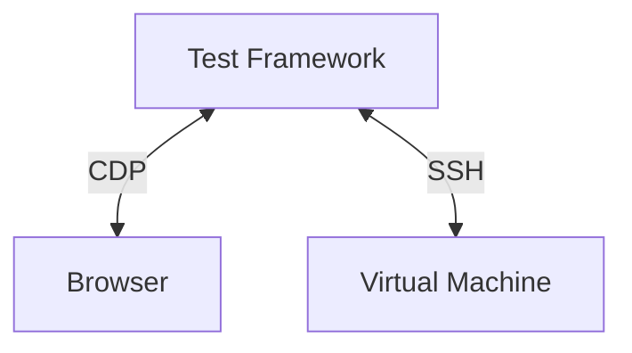
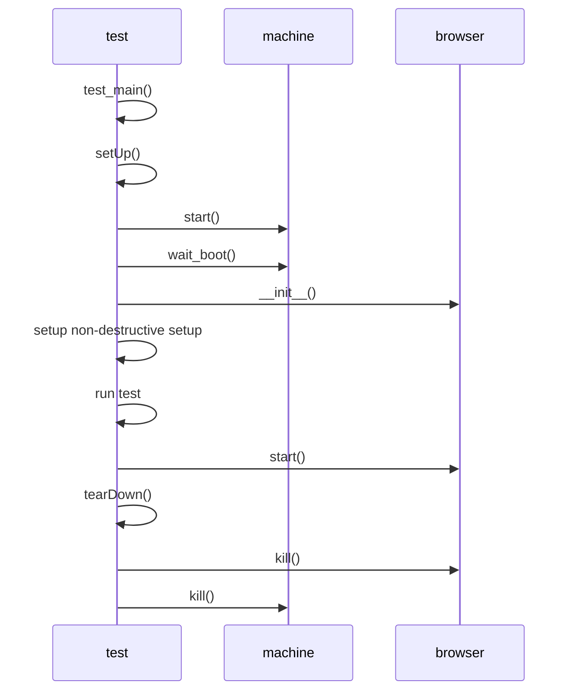
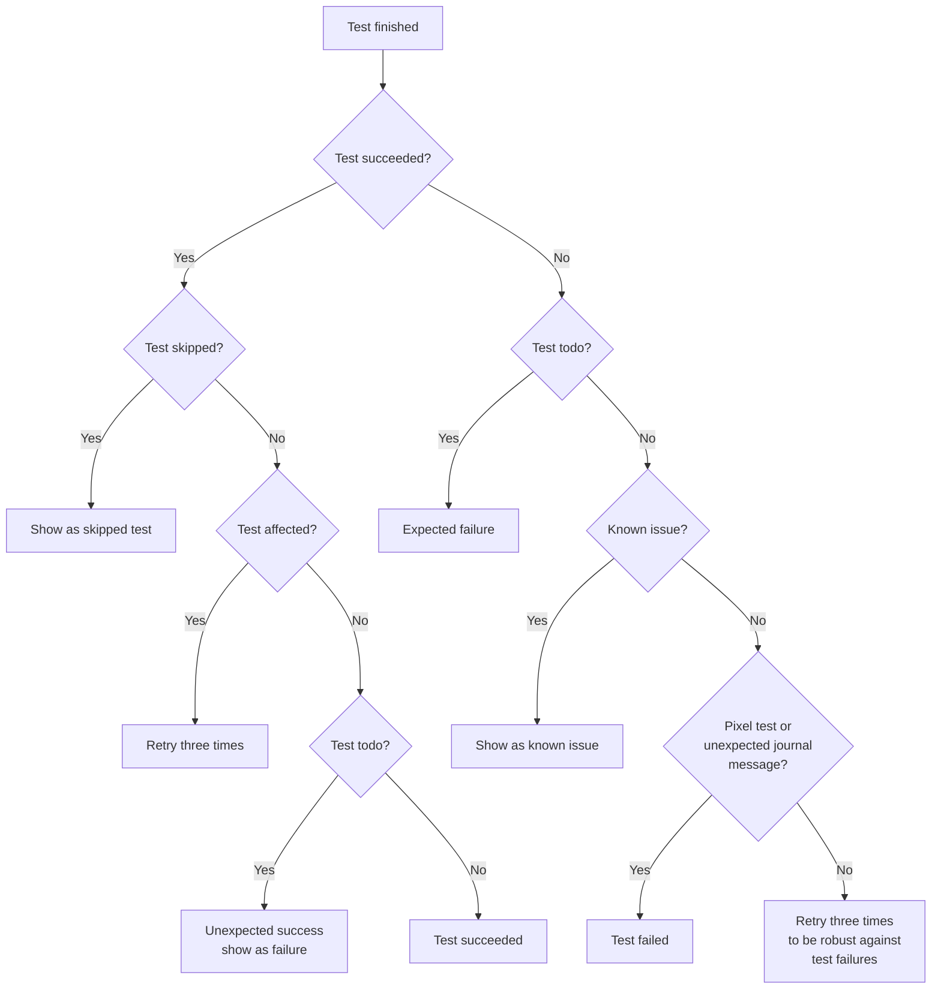

# Architecture

* [x] intro
* [x] Describe the choices we made
* [ ] Explain the test execution how the browser starts, Virtual machine `test/verify/check-apps`
* [ ] Explain the test runner `test/common/run-tests`
* [ ] Explain the Pr run workflow `test/run`

This document describes the architecture of Cockpit's browser integration
tests. The tests should replicate how a normal user interacts with Cockpit this
requires a test machine which can easily add have multiple disks or interfaces,
reboot, interact with multiple machines on the same network and run potentially
destructive test scenario's (e.g. installing/updating packages, formatting
disks).

For these reasons, Cockpit tests run inside a virtual machine (VM). The virtual
machine uses Cockpit specific virtual machine images maintained and created in
the [bots](https://github.com/cockpit-project/bots) repository. The images are
usually based on a distribution's cloud image customized with:

* A well-known password for the admin/root user
* Test SSH keys for access
* Test packages required to test Cockpit
* A build chroot with Cockpit's build dependencies to build the to be tested
  Cockpit source inside the virtual machine. This allows a developer on Fedora
  to easily prepare a Debian test image without having to install Debian build
  tools, builds also happen offline.
* Disabling system services which interfere with testing

To replicate a user, Cockpit is tested in a browser controlled using the
[Chrome DevTools Protocol](https://chromedevtools.github.io/devtools-protocol/)
(CDP) which is supported by Firefox and Chromium based browsers.

The Python test framework in `test/common` is responsible for setting up the
test environment.

Diagram of the interaction of Browser/Machine/CDP/Test Framework.


## Integration Test

Cockpit's tests can be run via three different entrypoints:

* `test/verify/check-$page` - run a single or multiple unit test
* `test/common/run-tests` - run tests through our test scheduler (retries, tracks naughties)
* `test/run` - run tests in Continous Integration (CI)

We will start with how a single integration test is run and then explore the test
scheduler and CI setup. The base of a Cockpit integration test looks as following:

```python
class TestApps(testlib.MachineCase):
    # Optionally instantiate another test virtual machine
    provision = {
        "0": {"memory_mb": 768},
        "ansible_machine": {"image": TEST_OS_DEFAULT, "memory_mb": 512}
    }

    def testBasic(self):
        self.machine.execute("rm /usr/share/cockpit/apps")
        self.browser.login_and_go("/apps")
        self.browser.wait_not_visible("#apps")

if __name__ == '__main__':
    testlib.test_main()
```

In Cockpit there are two types of tests, `destructive` and `nondestructive`
tests. Destructive tests do something to test virtual machine which makes it
unable to run another afterwards or requires another virtual machine for
testing. The test above is a destructive test which is the default, a non
destructive test makes sure any destructive action is restored after the test
has run as can be seen below.

```python
@testlib.nondestructive
class TestApps(testlib.MachineCase):
    def testBasic(self):
        self.restore_dir("/usr/share/cockpit/apps")
        self.machine.execute("rm /usr/share/cockpit/apps")
        self.browser.login_and_go("/apps")
        self.browser.wait_not_visible("#apps")

if __name__ == '__main__':
    testlib.test_main()
```

The test above would be invocated via `./test/verify/check-apps TestApps.testBasic`
and would execute as can be seen in the diagram below:


A test starts by calling `test_main`, this provides common command line
arguments for debugging and to optionally run a test on a different
machine/browser. These arguments are available in the `MachineCase` class as
`opts`. `test_main` also takes care of instantiating a `TapRunner` which runs
all the specified tests.

Every started test first runs `MachineCase.setUp` this instantiates a test
`Browser` class and depending on if the test is destructive or not a machine is
started. If it's a destructive tests, cleanup handlers are installed to restore
files in `/etc`, cleans up home directories etc.

The `Browser` class instantiates a browser when a test calls a `Browser` method
for example `self.browser.open`.

- Browser
- CDP class which uses `chrome-remote-interface`
- Specialized TestBrowser class for Firefox/Chromium with startup/profile stuff

On tearDown the test status is insepcted, if it failed test logs are collected
and if the user has passed `--sit` the test pauses execution until the user
presses enter so that the machine/browser state can be inspected.

The browser is automatically killed at the end of the test and the virtual
machine depending is killed only once the whole test suite finished or killed
in the following test `depending` if it's a `destructive` or nondestrucitve test.

All tests inherit from [MachineCase](common/testlib.py), this test class holds
a reference to the test Browser and Machine the relation between these
components can be seen in the diagram in the previous section.

## Test Runner

`test/common/run-tests` Python program collects all the provided tests and splits them up in
`serial` and `parallel` tests. `serial` tests are what our test library calls
`non-destructive` tests, these tests can be run multiple times against the same
(running) Virtual machine without failing. `parallel` tests are `destructive`
tests which for example require a reboot, or do something destructive from
which one cannot recover. Our test library has multiple helpers to make it easy
to make a test non-destructive. As we care about a fast test suite it's always
good to invest some time to make a test `non-destructive` as a lot of time is
spent on booting a machine ~ 10-20 seconds, while `non-destructive` tests can
re-use an already running machine. The tests are collected as `Test` object (in
`test/common/run-tests` which most importantly is created with a command e.g.
`./test/verify/check-apps $args`, a timeout, etc.)

Affected tests are collected by looking at the git diff of `test/verify` and
selecting all changed tests, if more then three tests have been changed no
tests are marked as affected. Then collecting a git diff between the current
branch and `main` of the `pkg/` directory and selecting the
`test/verify/check-$pkg` counterpart. So for example a Pull Request changing
`pkg/apps` will return `test/verify/check-apps` as affected test. Unless the
test has been decorated with `@testlib.no_retry_when_changed`.

When an affected test runs it will be retried three times to ensure the test is
not flaky.



Unstable tests, a test which fails once will always be re-tried as our CI
infrastructure is shared and timing issues can occur.

Naughties are expected test failures due to expected bugs in software we test,
we still run the test but if the test error output matches a known naughty it
is skipped. The [bots](github.com/cockpit-project/bots) repository keeps track
of all our known naughties per distro. (The bots repository has automation
setup to see if a naughty is still affected and if not open a pull request to
drop it).

After having collected the parallel, serial and affected tests a scheduling
loop is started, if a machine was provided it is used for the serial tests,
parallel tests will always spawn a new machine. If no machine is provided a
pool of global machines is created based on the provided `--jobs` and serial tests. 

The test runner will first try to assign all serial tests on the available
global machines and start the tests. The Test class `start()` method executed
the provided `command` with a `timeout`, creates a temporaryfile to store the
test result in and in a thight loop the process loop will call `Test.poll()`
which polls the spawned process if it's finished. If the process is finished
the output of the process is flushed to the temporary file and the returncode
of the process in `returncode`. Depending on the `returncode` or `retry_reason`
returned by calling `Test.finish()` the test is retried, skipped, or shown as
(un)expected failed due to the test being marked with `@testlib.todo`.

The started test runs for example `./test/verify/check-apps --machine 127.0.0.1 --browser`.

**FIXUP**
(the created global machines are STARTED by `test/common/run-tests`, first we
do the serial tests and then after we have slots parallel tests)

When starting a test via `./test/verify/check-apps` either with a
non-destructive test or using destructive tests with `provisioning` (explain)
the machines are created in `setUp` and started. After all machines are booted
the browser is started via the `Browser` class, which assigns this to be
`MachineCase` class making it available for interacting in tests. The browser
is always killed after a test is succeeded so we start with a fresh state: 

For non-destructive tests the setUp installs cleanup handlers to make sure new
users / home directories are automatically emptied, processes stopped. 

- Explain how the browser is started!!!
 Every test starts a new browser in `setUp`.
- How the virtual machine is started!!!
  ??? Good question, seems `setUp`
- More points where to look
- Use `test/run` to introduce all concepts
   -> start a VM, libvirt, bots, SSH
   -> start a Browser, CDP

- multi-server
- e2e interactive click browser
- ssh
- CDP with `chrome-remote-interface`

Pull requests start from `test/run` with a given `TEST_OS`

Entrypoints:

test/run
test/reference-image

An overview of the directories:

* browser - everything required for Testing Farm (TF) tests using Packit
* common - our test library, used in all Cockpit sub projects
* data - test data for integration tests
* pytest - Cockpit bridge unit tests
* reference - git submodule checkout of our pixel test images repository
* verify - integration tests

## Continuous Integration (CI)

In CI we have two entrypoints, one for our tests which runs on our own
managed infrastructure and one for tests which run on the testing farm (TF).

For our own managed infrastructure the entrypoint of the Cockpit tests is
`test/run` this bash script expects a `TEST_OS` environment variable to be set
to determine what distribution to run the tests under and a `TEST_SCENARIO`
environment variable to determine the type of test. Currently we support these
different scenario's:

* devel - runs tests with coverage enabled and generates a html file with coverage information
* pybridge - runs tests with the Python bridge
* firefox - runs tests using the Firefox browser instead of Chrome
* networking - runs all networking related tests
* storage - runs all storage related tests
* expensive - runs all expensive tests (usually tests which reboot/generate a new initramfs)
* other - runs all non-networking/storage/expensive tests.

Cockpit's tests are split up in scenario's to heavily parallize our testing and
allow for faster retrying.

The `test/run` prepares an Virtual machine image for the given `TEST_OS` and then
runs the tests by calling `test/common/run-tests` with the provided tests.

For the Testing Farm (TF) started and managed by Packit the entrypoint is
`test/browser/browser.sh`. On TF we get a single virtual machine without a
hypervisor so tests run on the virtual machine directly this also implies that
only `destructive` tests can be run.

## Pixel tests

Pixel tests in Cockpit ensure that updates of our dependencies or code changes
don't break unexpectedly break the UI, for example slight changes of layout,
padding, color and everything which isn't easily tested by a human. They also
give us confidence that an update of our UI Framework doesn't introduce changes
in how Cockpit looks.

Pixel tests are in essence quite simple, they make a screenshot of the current
state and compare this to a known good state, if there is a difference the test
fails and a pixel difference is shown. This works as our tests run in the
[cockpit/tasks container](https://quay.io/repository/cockpit/tasks) which pins
the browser and font rendering so repeated runs provide the same pixels. To
generate new pixels this tasks container should be used as your own browser and
font rendering software might generate different results.

The test images are stored in git submodule in the `test/reference` directory and be fetched with:

```sh
./test/common/pixel-tests fetch
```

As Cockpit tests under multiple distributions and it is not worth the effort to
run pixel tests on every supported distribution we only run them for the
configured image configured in `test/reference-image`.

Our tests don't know when it is interesting to make a screenshot of the current
state, so our tests have to specifically assert for saved pixels using
`browser.assert_pixels`. This assertion method requires an CSS selector to be
provided and a title of the image. Pixel tests are generated in five layouts by
default; desktop, medium, mobile, dark and rtl.

Take a screenshot the content in `#detail-content`:
```python
browser.assert_pixels("#detail-content", "filesystem")
```

Take a screenshot the content in `#detail-content` and ignore all elements with
a class `disk-stats` as they change per test run.
```python
browser.assert_pixels("#detail-content", "filesystem", ignore=[".disks-stats"])
```

Take a screenshot the content in `#detail-content` and skip it for a specific
layout as it generates unstable pixels.
```python
browser.assert_pixels("#detail-content", "filesystem", skip_layouts=["rtl"])
```

To update pixel tests it's recommended to either start use the tasks container
to generate specific new pixels or create a draft PR and let the tests run for
`test/reference-image` and afterwards fetching the new pixels:

```
./test/common/pixel-tests fetch "https://cockpit-logs.us-east-1.linodeobjects.com/<snip>/log.html
```

And then uploading the new pixel tests and committing the newly generated submodule commit.
```
./test/common/pixel-tests push
```

**Note** that you have to a part of the [Contributors
group](https://github.com/orgs/cockpit-project/teams/contributors) to push
pixel tests.
