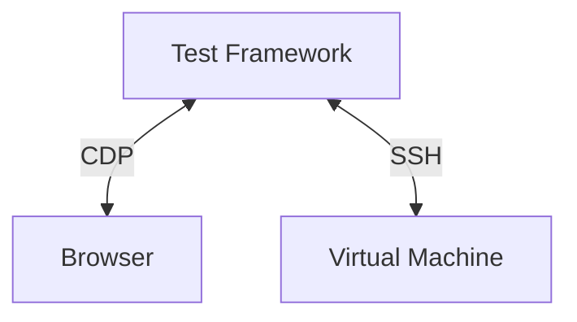

# Tests of Cockpit

This directory contains automated integration tests, pixel tests, unit tests
for Cockpit, and the support files for them.

## Goal of our integration tests

- what do we want to test

Cockpit depends on a lot of system API's and integrations for it's
functionality and depends on external dependencies for the webui. It is
important for us that Cockpit functions well on all supported distributions
with different versions of dependencies. Our automated tests should catch:

* Regressions introduced by pull requests
* Regressions introduced by new versions of API's we depend on
* Regressions introduced by (build) dependencies 

## Architecture

- offline
- destructive
- multi-server
- e2e interactive click browser
- ssh
- CDP with `chrome-remote-interface`
- sizzle
- Track naughties?

Our integration tests should replicate how a normal user interacts with Cockpit
this requires a test sandbox which can easily add have multiple disks or
interfaces, reboot, interact with multiple machines on the same network and run
potentially destructive test scenario's.

For these reasons, Cockpit tests run inside a testing virtual machine. Test
virtual machine images are maintained in the
[bots](https://github.com/cockpit-project/bots) repository. This repository
creates custom VM images with all the packages required to build and test
Cockpit so tests can execute and build offline. The code you want to test is
build on the test virtual machine so one can easily test Debian under Fedora
without having to install specific distro build tools.

To replicate a user, Cockpit is tested in a browser controlled using the
[Chrome DevTools Protocol](https://chromedevtools.github.io/devtools-protocol/)
(CDP) which is supported by Firefox and Chromium based browsers.

The test framework in `test/common` is responsible for setting up the test environment.

Diagram of the interaction of Browser/Machine/CDP/Testsuite.


For our continious integration (CI) the entrypoint of the Cockpit tests is
`test/run` this bash script expects a `TEST_OS` environment variable to be set
to determine what distribution to run the tests under and a `TEST_SCENARIO`
environment variable to determine the type of test. Currently we support these
different scenario's:

* devel - runs tests with coverage enabled and generates a html file with coverage information
* pybridge - runs tests with the Python bridge
* firefox - runs tests using the Firefox browser instead of Chrome
* networking - runs all networking related tests
* storage - runs all storage related tests
* expensive - runs all expensive tests (usually tests which reboot/generate a new initramfs)
* other - runs all non-networking/storage/expensive tests.

Cockpit's tests are split up in scenario's to heavily parallize and allow for faster retrying.

The script prepares an Virtual machine image for the given `TEST_OS` and then
runs the tests by calling `test/common/run-tests` with the provided tests. This
Python program collects all the provided tests and splits them up in `serial`
and `parallel` tests. `serial` tests are what our test library calls
`non-destructive` tests, these tests can be run multiple times against the same
(running) Virtual machine without failing. `parallel` tests are `destructive`
tests which for example require a reboot, or do something destructive from
which one cannot recover. Our test library has multiple helpers to make it easy
to make a test non-destructive. As we care about a fast test suite it's always
good to invest some time to make a test `non-destructive` as a lot of time is
spent on booting a machine ~ 1 minute, while `non-destructive` tests can re-use
an already running machine. The tests are collected as `Test` object (in
`test/common/run-tests` which most importantly is created with a command e.g.
`./test/verify/check-apps $args`, a timeout, etc.)

Affected tests are collected by looking at the git diff of `test/verify` and
selecting all changed tests, if more then three tests have been changed no
tests are marked as affected. Then collecting a git diff between the current
branch and `main` of the `pkg/` directory and selecting the
`test/verify/check-$pkg` counterpart. So for example a Pull Request changing
`pkg/apps` will return `test/verify/check-apps` as affected test. Unless the
test has been decorated with `@testlib.no_retry_when_changed`.

When an affected test runs it will be retried three times to ensure the test is
not flaky.

Unstable tests, a test which fails once will always be re-tried as our CI
infrastructure is shared and timing issues can occur.

After having collected the parallel, serial and affected tests a scheduling
loop is started, if a machine was provided it is used for the serial tests,
parallel tests will always spawn a new machine. If no machine is provided a
pool of global machines is created based on the provided `--jobs` and serial tests. 

The test runner will first try to assign all serial tests on the available
global machines and start the tests. The Test class `start()` method executed
the provided `command` with a `timeout`, creates a temporaryfile to store the
test result in and in a thight loop the process loop will call `Test.poll()`
which polls the spawned process if it's finished. If the process is finished
the output of the process is flushed to the temporary file and the returncode
of the process in `returncode`. Depending on the `returncode` or `retry_reason`
returned by calling `Test.finish()` the test is retried, skipped, or shown as
(un)expected failed due to the test being marked with `@testlib.todo`.

**TODO:** check with pitti how the parallel tests run
**TODO:** Diagram of this thight loop?
**TODO:** Explain naughties?


- Explain how the browser is started
- How the virtual machine is started
- More points where to look
- Use `test/run` to introduce all concepts
   -> start a VM, libvirt, bots, SSH
   -> start a Browser, CDP

Pull requests start from `test/run` with a given TEST_OS

Entrypoints:

test/run
test/reference-image

An overview of the directories:

* browser - everything required for Testing Farm (TF) tests using Packit
* common - our test library, used in all Cockpit sub projects
* data - test data for integration tests
* pytest - Cockpit bridge unit tests
* reference - git submodule checkout of our pixel test images repository
* verify - integration tests

### Pixel tests

Pixel tests in Cockpit ensure that updates of our dependencies or code changes
don't break unexpectedly break the UI, for example slight changes of layout,
padding, color and everything which isn't easily tested by a human. They also
give us confidence that an update of our UI Framework doesn't introduce changes
in how Cockpit looks.

Pixel tests are in essence quite simple, they make a screenshot of the current
state and compare this to a known good state, if there is a difference the test
fails and a pixel difference is shown. This works as our tests run in the
[cockpit/tasks container](https://quay.io/repository/cockpit/tasks) which pins
the browser and font rendering so repeated runs provide the same pixels. To
generate new pixels this tasks container should be used as your own browser and
font rendering software might generate different results.

The test images are stored in git submodule in the `test/reference` directory and be fetched with:

```sh
./test/common/pixel-tests fetch
```

As Cockpit tests under multiple distributions and it is not worth the effort to
run pixel tests on every supported distribution we only run them for the
configured image configured in `test/reference-image`.

Our tests don't know when it is interesting to make a screenshot of the current
state, so our tests have to specifically assert for saved pixels using
`browser.assert_pixels`. This assertion method requires an CSS selector to be
provided and a title of the image. Pixel tests are generated in five layouts by
default; desktop, medium, mobile, dark and rtl.

Take a screenshot the content in `#detail-content`:
```python
browser.assert_pixels("#detail-content", "filesystem")
```

Take a screenshot the content in `#detail-content` and ignore all elements with
a class `disk-stats` as they change per test run.
```python
browser.assert_pixels("#detail-content", "filesystem", ignore=[".disks-stats"])
```

Take a screenshot the content in `#detail-content` and skip it for a specific
layout as it generates unstable pixels.
```python
browser.assert_pixels("#detail-content", "filesystem", skip_layouts=["rtl"])
```

To update pixel tests it's recommended to either start use the tasks container
to generate specific new pixels or create a draft PR and let the tests run for
`test/reference-image` and afterwards fetching the new pixels:

```
./test/common/pixel-tests fetch "https://cockpit-logs.us-east-1.linodeobjects.com/<snip>/log.html
```

And then uploading the new pixel tests and committing the newly generated submodule commit.
```
./test/common/pixel-tests push
```

**Note** that you have to a part of the [Contributors
group](https://github.com/orgs/cockpit-project/teams/contributors) to push
pixel tests.

## How to get started

### Setup VM

## Writing a new test

### non destructive/destructive

## Tips & Tricks

### Unexpected journal message

After a test run the testsuite reads the journal, looks for errors and fails
the test if there are errors. As a test can cause harmless errors to end up in
the journal our test library defines a list of allowed journal messages. If
your test triggers a harmless error message you can add it to the allow list
using `self.allow_journal_messages`.

During local testing SELinux violations can be ignored by setting
`TEST_AUDIT_NO_SELINUX`.

### Debugging

### Coverage

Every pull request will trigger a `$DEFAULT_OS/devel` scenario which creates a
coverage report of the JavaScript code and writes comments about uncovered code
in the pull request. Coverage is recorded in prometheus for a subset of our
projects and [visualized in
Grafana](https://grafana-cockpit.apps.ocp.cloud.ci.centos.org/d/ci/cockpit-ci?orgId=1).

To generate coverage locally for `TestApps`:

```
export NODE_ENV=devel
./build.js
./test/image-prepare -q
./test/common/run-tests --test-dir test/verify --coverage TestApps
```

Code which will never get executed in tests can be ignored by adding a
`not-covered` comment:

```javascript
    return cockpit.script(data, { superuser: "try", err: "message" })
                  .catch(console.error); // not-covered: OS error
```

Collecting coverage is done by using the browser's native profiling
instrumentation over CDP. On browser startup `Profiler.enable` and
`Profiler.startPreciseCoverage` is called. Once the test run is completed
`Profiler.takePreciseCoverage` is called to collect the coverage data and
converted and written on disk in lcov format. After the all the machines are
torn down, a coverage report is generated using lcov.

- Link `test/common/lcov.py`
