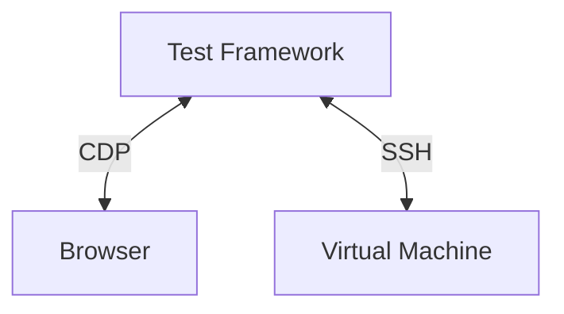

# Tests of Cockpit

This directory contains automated integration tests, pixel tests, unit tests
for Cockpit, and the support files for them.

## Goal of our integration tests

- what do we want to test

Cockpit depends on a lot of system API's and integrations for it's
functionality and depends on external dependencies for the webui. It is
important for us that Cockpit functions well on all supported distributions
with different versions of dependencies. Our automated tests should catch:

* Regressions introduced by pull requests
* Regressions introduced by new versions of API's we depend on
* Regressions introduced by (build) dependencies 

## Architecture

- offline
- destructive
- multi-server
- e2e interactive click browser

Our integration tests should replicate how a normal user interacts with Cockpit
this requires a test sandbox which can easily add have multiple disks or
interfaces, reboot, interact with multiple machines on the same network and run
potentially destructive test scenario's.

For these reasons, Cockpit tests run inside a testing virtual machine which is
controlled from our test framework. The test framework is responsible for
setting up a virtual machine, opening ports for the browser and ssh for
executing test commands.

To replicate a user, the test framework spawns a browser and controls this
using the [Chrome DevTools
Protocol](https://chromedevtools.github.io/devtools-protocol/) (CDP) which is
supported by Firefox and Chromium based browsers.

- CDP
- Control of VM's
- Diagram of test setup / VM/framework/Browser
- Python

An overview of the directories:

* browser - everyone required for Testing Farm (TF) tests using Packit
* common - our test library, used in all Cockpit sub projects
* data - test data for integration tests
* pytest - Cockpit bridge unit tests
* reference - git submodule checkout of our pixel test images repository
* verify - integration tests

Diagram of the interaction of Browser/Machine/CDP/Testsuite.

### Pixel tests

## How to get started

### Setup VM

## Writing a new test

### non destructive/destructive

## Tips & Tricks

### Debugging

### Coverage

