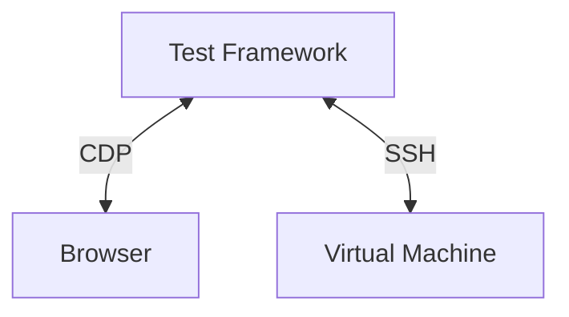

# Tests of Cockpit

This directory contains automated integration tests, pixel tests, unit tests
for Cockpit, and the support files for them.

## Goal of our integration tests

- what do we want to test

Cockpit depends on a lot of system API's and integrations for it's
functionality and depends on external dependencies for the webui. It is
important for us that Cockpit functions well on all supported distributions
with different versions of dependencies. Our automated tests should catch:

* Regressions introduced by pull requests
* Regressions introduced by new versions of API's we depend on
* Regressions introduced by (build) dependencies 

## Architecture

- offline
- destructive
- multi-server
- e2e interactive click browser

Our integration tests should replicate how a normal user interacts with Cockpit
this requires a test sandbox which can easily add have multiple disks or
interfaces, reboot, interact with multiple machines on the same network and run
potentially destructive test scenario's.

For these reasons, Cockpit tests run inside a testing virtual machine which is
controlled from our test framework. The test framework is responsible for
setting up a virtual machine, opening ports for the browser and ssh for
executing test commands.

To replicate a user, the test framework spawns a browser and controls this
using the [Chrome DevTools
Protocol](https://chromedevtools.github.io/devtools-protocol/) (CDP) which is
supported by Firefox and Chromium based browsers.



The test virtual machine's base image come from the
[bots](https://github.com/cockpit-project/bots) repository for all supported
distributions. 

- CDP
- Control of VM's
- Diagram of test setup / VM/framework/Browser
- Python

Entrypoints:

test/run
test/reference-image

An overview of the directories:

* browser - everyone required for Testing Farm (TF) tests using Packit
* common - our test library, used in all Cockpit sub projects
* data - test data for integration tests
* pytest - Cockpit bridge unit tests
* reference - git submodule checkout of our pixel test images repository
* verify - integration tests


Diagram of the interaction of Browser/Machine/CDP/Testsuite.

### Pixel tests

Pixel tests in Cockpit ensure that updates of our dependencies or code changes
don't break unexpectedly break the UI, for example slight changes of layout,
padding, color and everything which isn't easily tested by a human. They also
give us confidence that an update of our UI Framework doesn't introduce changes
in how Cockpit looks.

Pixel tests are in essence quite simple, they make a screenshot of the current
state and compare this to a known good state, if there is a difference the test
fails and a pixel difference is shown. This works as our tests run in the
[cockpit/tasks container](https://quay.io/repository/cockpit/tasks) which pins
the browser and font rendering so repeated runs provide the same pixels. To
generate new pixels this tasks container should be used as your own browser and
font rendering software might generate different results.

The test images are stored in git submodule in the `test/reference` directory and be fetched with:

```sh
./test/common/pixel-tests fetch
```

As Cockpit tests under multiple distributions and it is not worth the effort to
run pixel tests on every supported distribution we only run them for the
configured image configured in `test/reference-image`.

Our tests don't know when it is interesting to make a screenshot of the current
state, so our tests have to specifically assert for saved pixels using
`browser.assert_pixels`. This assertion method requires an CSS selector to be
provided and a title of the image. Pixel tests are generated in five layouts by
default; desktop, medium, mobile, dark and rtl.

Take a screenshot the content in `#detail-content`:
```python
browser.assert_pixels("#detail-content", "filesystem")
```

Take a screenshot the content in `#detail-content` and ignore all elements with
a class `disk-stats` as they change per test run.
```python
browser.assert_pixels("#detail-content", "filesystem", ignore=[".disks-stats"])
```

Take a screenshot the content in `#detail-content` and skip it for a specific
layout as it generates unstable pixels.
```python
browser.assert_pixels("#detail-content", "filesystem", skip_layouts=["rtl"])
```

To update pixel tests it's recommended to either start use the tasks container
to generate specific new pixels or create a draft PR and let the tests run for
`test/reference-image` and afterwards fetching the new pixels:

```
./test/common/pixel-tests fetch "https://cockpit-logs.us-east-1.linodeobjects.com/<snip>/log.html
```

And then uploading the new pixel tests and committing the newly generated submodule commit.
```
./test/common/pixel-tests push
```

**Note** that you have to a part of the [Contributors
group](https://github.com/orgs/cockpit-project/teams/contributors) to push
pixel tests.

## How to get started

### Setup VM

## Writing a new test

### non destructive/destructive

## Tips & Tricks

### Debugging

### Coverage


