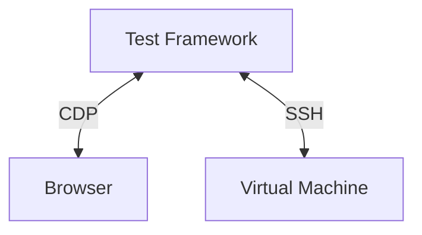
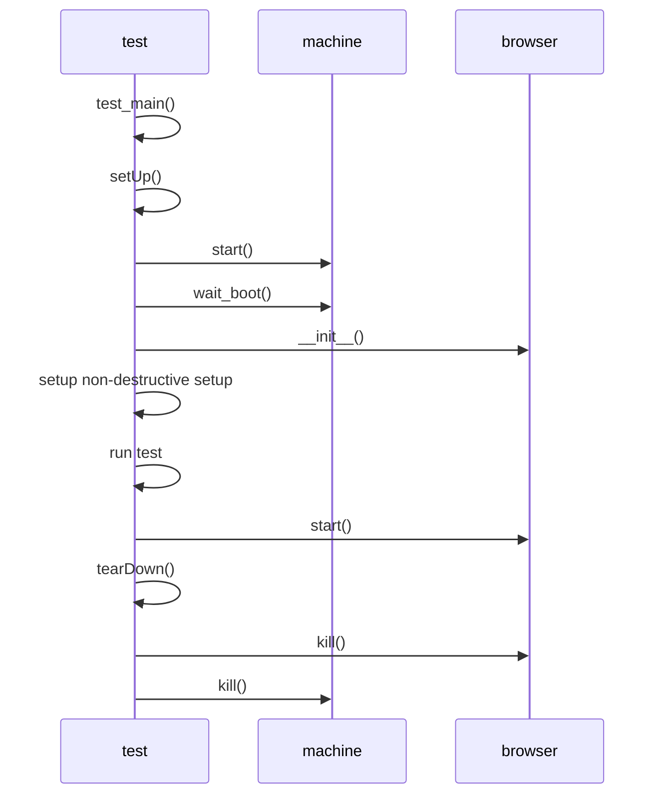
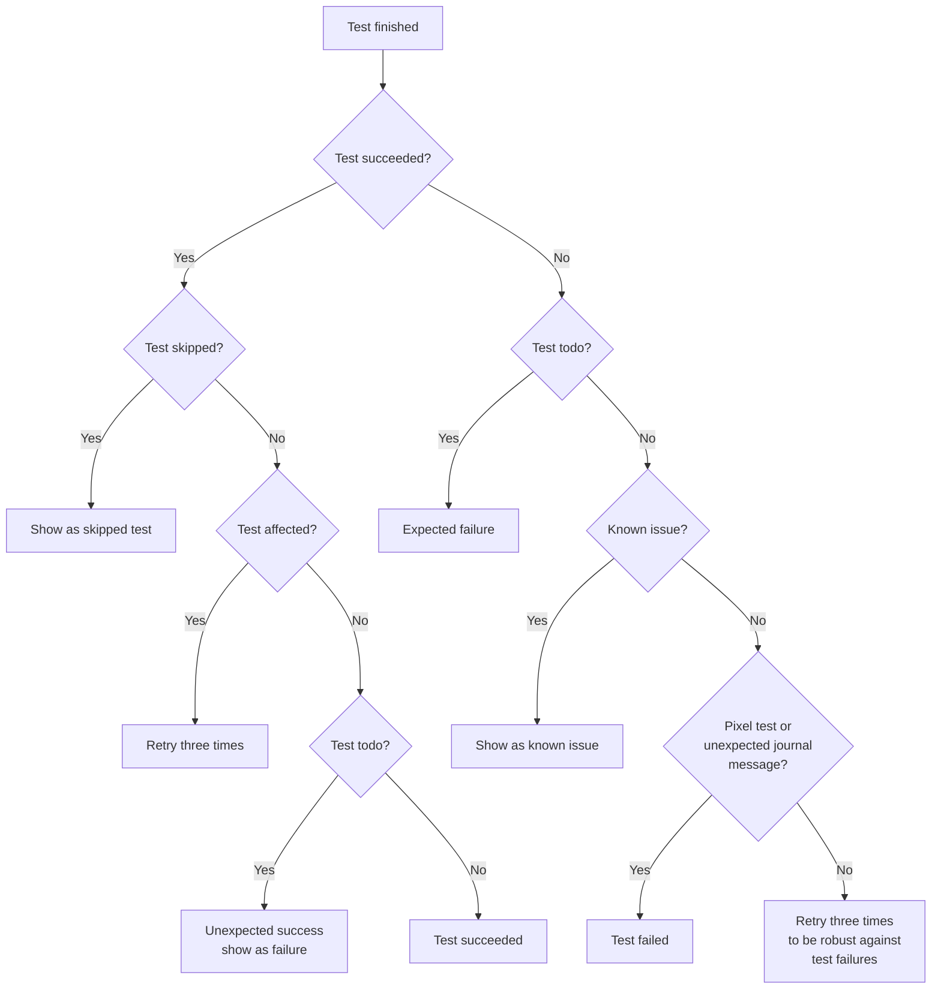

# Tests of Cockpit

An overview of the directories:

* browser - everything required for Testing Farm (TF) tests using Packit
* common - our test library, used in all Cockpit sub projects
* data - test data for integration tests
* pytest - Cockpit bridge unit tests
* reference - git submodule checkout of our pixel test images repository
* verify - integration tests

This directory contains automated integration tests, pixel tests, unit tests
for Cockpit, and the support files for them.

## Goal of our integration tests

- what do we want to test

Cockpit depends on a lot of system API's and integrations for it's
functionality and depends on external dependencies for the webui. It is
important for us that Cockpit functions well on all supported distributions
with different versions of dependencies. Our automated tests should catch:

* Regressions introduced by pull requests
* Regressions introduced by new versions of API's we depend on
* Regressions introduced by (build) dependencies 

## Architecture

The integration tests should replicate how a normal user interacts with Cockpit
this requires a test machine which can easily add have multiple disks or
interfaces, reboot, interact with multiple machines on the same network and run
potentially destructive test scenario's. (e.g. installing/updating packages,
formatting disks)

For these reasons, Cockpit tests run inside a testing virtual machine (VM).
Test virtual machine images are maintained in the
[bots](https://github.com/cockpit-project/bots) repository. This repository
creates custom VM images with all the packages required to build and test
Cockpit so tests can execute and build offline. The Cockpit source code you
want to test is build on the test virtual machine so one can easily test Debian
under Fedora without having to install specific distro build tools.

To replicate a user, Cockpit is tested in a browser controlled using the
[Chrome DevTools Protocol](https://chromedevtools.github.io/devtools-protocol/)
(CDP) which is supported by Firefox and Chromium based browsers.

The test framework in `test/common` is responsible for setting up the test environment.

Diagram of the interaction of Browser/Machine/CDP/Testsuite.


### Integration Test

- Start with `MachineCase` class
- Or start with just a single unittest?

Cockpit's tests can be run via three different entrypoints:
* `test/run` - this is only used in Continous Integration (CI)
* `test/common/run-tests` - run tests through our test scheduler (retries, tracks naughties)
* `test/verify/check-$page` - run a single or multiple unit test

We will start with how a single unit test is run and then explore the test
scheduler and CI setup. The base of a Cockpit integration test looks as following:

```python
class TestFoo(testlib.MachineCase):
    def testBasic():
        pass

if __name__ == '__main__':
    testlib.test_main()
```

All tests use call `test_main()` which provides common test arguments and
starts the test provided using our own test runner. 



When starting a test via `./test/verify/check-apps` either with a
non-destructive test or using destructive tests with `provisioning` (explain)
the machines are created in `setUp` and started. After all machines are booted
the browser is started via the `Browser` class, which assigns this to be
`MachineCase` class making it available for interacting in tests. The browser
is always killed after a test is succeeded so we start with a fresh state: 

For non-destructive tests the setUp installs cleanup handlers to make sure new
users / home directories are automatically emptied, processes stopped. 

### Test Runner

For our continious integration (CI) the entrypoint of the Cockpit tests is
`test/run` this bash script expects a `TEST_OS` environment variable to be set
to determine what distribution to run the tests under and a `TEST_SCENARIO`
environment variable to determine the type of test. Currently we support these
different scenario's:

* devel - runs tests with coverage enabled and generates a html file with coverage information
* pybridge - runs tests with the Python bridge
* firefox - runs tests using the Firefox browser instead of Chrome
* networking - runs all networking related tests
* storage - runs all storage related tests
* expensive - runs all expensive tests (usually tests which reboot/generate a new initramfs)
* other - runs all non-networking/storage/expensive tests.

Cockpit's tests are split up in scenario's to heavily parallize our testing and
allow for faster retrying.

The `test/run` prepares an Virtual machine image for the given `TEST_OS` and then
runs the tests by calling `test/common/run-tests` with the provided tests. This
Python program collects all the provided tests and splits them up in `serial`
and `parallel` tests. `serial` tests are what our test library calls
`non-destructive` tests, these tests can be run multiple times against the same
(running) Virtual machine without failing. `parallel` tests are `destructive`
tests which for example require a reboot, or do something destructive from
which one cannot recover. Our test library has multiple helpers to make it easy
to make a test non-destructive. As we care about a fast test suite it's always
good to invest some time to make a test `non-destructive` as a lot of time is
spent on booting a machine ~ 10-20 seconds, while `non-destructive` tests can
re-use an already running machine. The tests are collected as `Test` object (in
`test/common/run-tests` which most importantly is created with a command e.g.
`./test/verify/check-apps $args`, a timeout, etc.)

Affected tests are collected by looking at the git diff of `test/verify` and
selecting all changed tests, if more then three tests have been changed no
tests are marked as affected. Then collecting a git diff between the current
branch and `main` of the `pkg/` directory and selecting the
`test/verify/check-$pkg` counterpart. So for example a Pull Request changing
`pkg/apps` will return `test/verify/check-apps` as affected test. Unless the
test has been decorated with `@testlib.no_retry_when_changed`.

When an affected test runs it will be retried three times to ensure the test is
not flaky.



Unstable tests, a test which fails once will always be re-tried as our CI
infrastructure is shared and timing issues can occur.

Naughties are expected test failures due to expected bugs in software we test,
we still run the test but if the test error output matches a known naughty it
is skipped. The [bots](github.com/cockpit-project/bots) repository keeps track
of all our known naughties per distro. (The bots repository has automation
setup to see if a naughty is still affected and if not open a pull request to
drop it).

After having collected the parallel, serial and affected tests a scheduling
loop is started, if a machine was provided it is used for the serial tests,
parallel tests will always spawn a new machine. If no machine is provided a
pool of global machines is created based on the provided `--jobs` and serial tests. 

The test runner will first try to assign all serial tests on the available
global machines and start the tests. The Test class `start()` method executed
the provided `command` with a `timeout`, creates a temporaryfile to store the
test result in and in a thight loop the process loop will call `Test.poll()`
which polls the spawned process if it's finished. If the process is finished
the output of the process is flushed to the temporary file and the returncode
of the process in `returncode`. Depending on the `returncode` or `retry_reason`
returned by calling `Test.finish()` the test is retried, skipped, or shown as
(un)expected failed due to the test being marked with `@testlib.todo`.

The started test runs for example `./test/verify/check-apps --machine 127.0.0.1 --browser`.

**FIXUP**
(the created global machines are STARTED by `test/common/run-tests`, first we
do the serial tests and then after we have slots parallel tests)

When starting a test via `./test/verify/check-apps` either with a
non-destructive test or using destructive tests with `provisioning` (explain)
the machines are created in `setUp` and started. After all machines are booted
the browser is started via the `Browser` class, which assigns this to be
`MachineCase` class making it available for interacting in tests. The browser
is always killed after a test is succeeded so we start with a fresh state: 

For non-destructive tests the setUp installs cleanup handlers to make sure new
users / home directories are automatically emptied, processes stopped. 

- Explain how the browser is started!!!
 Every test starts a new browser in `setUp`.
- How the virtual machine is started!!!
  ??? Good question, seems `setUp`
- More points where to look
- Use `test/run` to introduce all concepts
   -> start a VM, libvirt, bots, SSH
   -> start a Browser, CDP

- multi-server
- e2e interactive click browser
- ssh
- CDP with `chrome-remote-interface`

Pull requests start from `test/run` with a given `TEST_OS`

Entrypoints:

test/run
test/reference-image

An overview of the directories:

* browser - everything required for Testing Farm (TF) tests using Packit
* common - our test library, used in all Cockpit sub projects
* data - test data for integration tests
* pytest - Cockpit bridge unit tests
* reference - git submodule checkout of our pixel test images repository
* verify - integration tests

### Pixel tests

Pixel tests in Cockpit ensure that updates of our dependencies or code changes
don't break unexpectedly break the UI, for example slight changes of layout,
padding, color and everything which isn't easily tested by a human. They also
give us confidence that an update of our UI Framework doesn't introduce changes
in how Cockpit looks.

Pixel tests are in essence quite simple, they make a screenshot of the current
state and compare this to a known good state, if there is a difference the test
fails and a pixel difference is shown. This works as our tests run in the
[cockpit/tasks container](https://quay.io/repository/cockpit/tasks) which pins
the browser and font rendering so repeated runs provide the same pixels. To
generate new pixels this tasks container should be used as your own browser and
font rendering software might generate different results.

The test images are stored in git submodule in the `test/reference` directory and be fetched with:

```sh
./test/common/pixel-tests fetch
```

As Cockpit tests under multiple distributions and it is not worth the effort to
run pixel tests on every supported distribution we only run them for the
configured image configured in `test/reference-image`.

Our tests don't know when it is interesting to make a screenshot of the current
state, so our tests have to specifically assert for saved pixels using
`browser.assert_pixels`. This assertion method requires an CSS selector to be
provided and a title of the image. Pixel tests are generated in five layouts by
default; desktop, medium, mobile, dark and rtl.

Take a screenshot the content in `#detail-content`:
```python
browser.assert_pixels("#detail-content", "filesystem")
```

Take a screenshot the content in `#detail-content` and ignore all elements with
a class `disk-stats` as they change per test run.
```python
browser.assert_pixels("#detail-content", "filesystem", ignore=[".disks-stats"])
```

Take a screenshot the content in `#detail-content` and skip it for a specific
layout as it generates unstable pixels.
```python
browser.assert_pixels("#detail-content", "filesystem", skip_layouts=["rtl"])
```

To update pixel tests it's recommended to either start use the tasks container
to generate specific new pixels or create a draft PR and let the tests run for
`test/reference-image` and afterwards fetching the new pixels:

```
./test/common/pixel-tests fetch "https://cockpit-logs.us-east-1.linodeobjects.com/<snip>/log.html
```

And then uploading the new pixel tests and committing the newly generated submodule commit.
```
./test/common/pixel-tests push
```

**Note** that you have to a part of the [Contributors
group](https://github.com/orgs/cockpit-project/teams/contributors) to push
pixel tests.

## How to get started

*Warning*: Never run the build, test, or any other command here as root!

### Preparing a test VM

You first need to build cockpit, and install it into a VM:

    test/image-prepare

This uses the default OS image, which is currently Fedora 38. See `$TEST_OS`
below how to select a different one.

*Tip*: Passing `-q` to `image-prepare` creates the image faster by skipping running the unit tests

### Running a test

In most cases you want to run an individual test in a suite, for example:

    test/verify/check-metrics TestCurrentMetrics.testCPU

You can get a list of tests by inspecting the `def test*` in the source, or by
running the suite with `-l`/`--list`:

    test/verify/check-metrics -l

Sometimes you may also want to run all tests in a test file suite:

    test/verify/check-session

To see more verbose output from the test, use the `-v`/`--verbose` and/or `-t`/`--trace` flags:

    test/verify/check-session --verbose --trace

If you specify `-s`/`--sit` in addition, then the test will wait on failure and
allow you to log into cockpit and/or the test instance and diagnose the issue.
The cockpit and SSH addresses of the test instance will be printed:

    test/verify/check-session -st

You can also run *all* the tests, with some parallelism:

    test/common/run-tests --test-dir test/verify --jobs 2

However, this will take *really* long. You can specify a subset of tests (see
`--help`); but usually it's better to run individual tests locally, and let the
CI machinery run all of them in a draft pull request.

The tests will automatically download the VM images they need, so expect
that the initial run may take a few minutes.

#### Interactive browser

Normally each test starts its own chromium headless browser process on a
separate random port. To interactively follow what a test is doing:

    TEST_SHOW_BROWSER=1 test/verify/check-session --trace

You can also run a test against Firefox instead of Chromium:

    TEST_BROWSER=firefox test/verify/check-session --trace

See below for details.

#### Test configuration

You can set these environment variables to configure the test suite:

* `TEST_OS`: The OS to run the tests in.  Currently supported values:
                  "centos-8-stream"
                  "debian-stable"
                  "debian-testing"
                  "fedora-37"
                  "fedora-38"
                  "fedora-coreos"
                  "fedora-testing"
                  "rhel-8-9"
                  "rhel-8-9-distropkg"
                  "rhel-9-3"
                  "rhel4edge",
                  "ubuntu-2204"
                  "ubuntu-stable"
                  "fedora-38" is the default (TEST_OS_DEFAULT in bots/lib/constants.py)

* `TEST_JOBS`: How many tests to run in parallel.  The default is 1.

* `TEST_CDP_PORT`: Attach to an actually running browser that is compatible with
                   the Chrome Debug Protocol, on the given port. Don't use this
                   with parallel tests.

* `TEST_BROWSER`: What browser should be used for testing. Currently supported values:
                     "chromium"
                     "firefox"
                     "chromium" is the default.

* `TEST_SHOW_BROWSER`: Set to run browser interactively. When not specified,
                       browser is run in headless mode. When set to "pixels",
                       the browser will be resized to the exact dimensions that
                       are used for pixel tests.

* `TEST_TIMEOUT_FACTOR`: Scale normal timeouts by given integer. Useful for
                        slow/busy testbeds or architectures.

See the [bots documentation](https://github.com/cockpit-project/bots/blob/main/README.md)
for details about the tools and configuration for these.

#### Fast develop/test iteration

Each `image-prepare` invocation will always start from the pristine image and
ignore the current overlay in `test/images`. It is thorough, but also rather
slow. If you want to iterate on changing only JavaScript/HTML code, as opposed
to the bridge or webserver, the whole build and test cycle can be done much
faster.

You always need to do at least one initial `test/image-prepare $TEST_OS` run.
Afterwards it depends on the kind of test you want to run.

##### Nondestructive tests

Many test methods or classes are marked as `@nondestructive`, meaning that
they restore the state of the test VM enough that other tests can run
afterwards. This is the fastest and most convenient situation for both
iterating on the code and debugging failing tests.

Start the prepared VM with `bots/vm-run $TEST_OS`. Note the SSH and cockpit
ports. If this is the only running VM, it will have the ports in the
examples below, otherwise the port will be different.

Then start building the page you are working on
[in watch and rsync mode](../HACKING.md#working-on-cockpits-session-pages), e.g.

    RSYNC=c ./build.js -w users

(Assuming the `c` SSH alias from the previous section and first running VM).

Then you can run a corresponding test against the running VM, with additional
debug output:

    TEST_OS=... test/verify/check-users -t --machine 127.0.0.2:2201 --browser 127.0.0.2:9091 TestAccounts.testBasic

##### Destructive tests

Other tests need one or more fresh VMs. Instead of a full `test/image-prepare`
run (which is slow), you can update the existing VM overlay with updated
bundles. Start the build in watch mode, but without rsyncing, e.g.

    ./build.js -w storaged

and after each iteration, copy the new bundles into the VM overlay:

    bots/image-customize -u dist:/usr/share/cockpit/ $TEST_OS

Then run the test as you would normally do, e.g.

    TEST_OS=... test/verify/check-storage-stratis -t TestStorageStratis.testBasic

Use `bots/vm-reset` to clean up all prepared overlays in `test/images`.

### Writing a new test

The integration tests are located in the `verify` directory and usually named
`test-$page-$component` for example `check-system-terminal`. All tests are written
using Python's `unittest` library and inherit from `MachineCase`. Below
is an example of a test which logs in and verifies that expected HTML classes
are there:

```python
class TestLogin(MachineCase):
    def testBasic(self):
        b = self.browser
        m = self.machine

        b.open("/system")
        b.wait_visible("#login")
        b.set_val("#login-user-input", "admin")
        b.set_val("#login-password-input", "foobar")
        b.click("#login-button")
        b.enter_page("/system")

        b.wait_visible("#content")
        b.wait_visible('#system_information_os_text')
```

We define a new test class `TestLogin` which inherits from the `MachineCase`
class, this class does a few things for us. It gives us a `self.machine`
variable which is a `TestVM` object that can be used to interact with the test
machine. The `self.browser` variable is an instance of the `Browser` class
which is how we interact with the test browser and control it.

FIXME: Expand with:
- how CSS selectors work / sizzle
- sizzle explaniation
- where to look in Testlib for helpers

### Conditional execution of tests

Cockpit is tested on multiple distributions and versions, some features are
specific to one particular distro for such scenario's Cockpit has multiple ways
to skip a test.

To only test on RHEL the `onlyImage` decorator can be used
```
@onlyImage('rhel-*')
class TestRhelFeature(MachineCase):
    ...
```

To skip a test because for example RHEL lacks a feature:

```python
@skipImage("no btrfs support on RHEL", "rhel-*")`
class TestBtrfs(MachineCase):
    ...
```

Other commonly used decorators:

* `skipOstree` - skip a test on an OSTree based distribution
* `skipMobile` - skip a test on a mobile resolution

All test decorators can be found in [test/common/testlib.py](https://github.com/cockpit-project/cockpit/blob/293/test/common/testlib.py#L2171)

### Destructive versus non-destructive tests

Cockpit tests can be divided into two types of tests, decorated with
`@nondestructive` and without. When running the test suite, the tests are
divided into separate groups of destructive and non-destructive tests. A
non-Destructive tests can be run multiple times with the same test machine and
run after each other and do not interfere with other tests. Destructive tests
make it so that another test can not run after it completed.

For non-destructive tests we have several helpers which can restore edited
files or directories to their previous state, such as:

* `self.write_file` - write or appends content to a file and automatically
  restores the old contents, also can optionally accept a `post_restore_action`
  to for example restart a service.
* `self.restore_file` / `self.restore_dir` - call this before executing
  destructive file operations, to automatically have the old contents restored
  after the test finished, also can optionally accept a `post_restore_action`
  to for example restart a service.
* `self.addCleanup` - this [unittest module
  function](https://docs.python.org/3/library/unittest.html?highlight=addcleanup#unittest.TestCase.addCleanup)
  can be used clean up temporarily files / or stop started services. For
  example `self.addCleanup(m.execute, "systemctl stop redis")`.

### non destructive/destructive

## Tips & Tricks

### Ignore Certificate errors

For web access, if you'd like to avoid Chromium (or Chrome) prompting
about certificate errors while connecting to localhost, you can change
the following setting:

    chrome://flags/#allow-insecure-localhost

### Unexpected journal message

After a test run the testsuite reads the journal, looks for errors and fails
the test if there are errors. As a test can cause harmless errors to end up in
the journal our test library defines a list of allowed journal messages. If
your test triggers a harmless error message you can add it to the allow list
using `self.allow_journal_messages`.

During local testing SELinux violations can be ignored by setting
`TEST_AUDIT_NO_SELINUX`.

### Convenient test VM SSH access

It is recommended to add a snippet like this to your `~/.ssh/config`. Then
you can log in to test machines without authentication:

    Match final host 127.0.0.2
        User root
        StrictHostKeyChecking no
        UserKnownHostsFile /dev/null
        CheckHostIp no
        IdentityFile CHECKOUT_DIR/bots/machine/identity
        IdentitiesOnly yes

You need to replace `CHECKOUT_DIR` with the actual directory where you cloned
`cockpit.git`, or `bots.git` if you have a separate clone for that.

Many cockpit developers take it a step further, and add an alias to
allow typing `ssh c`:

    Host c
        Hostname 127.0.0.2
        Port 2201

The `final` keyword in the first rule will cause it to be checked (and matched)
after the `Hostname` substitution in the `c` rule.

### Debugging tests

If you pass the `-s` ("sit on failure") option to a test program, it
will pause when a failure occurs so that you can log into the test
machine and investigate the problem.

A test will print out the commands to access it when it fails in this
way. You can log into a running test-machine using ssh.  See the
section above.

You can also put calls to `sit()` into the tests themselves to stop them
at strategic places.

That way, you can run a test cleanly while still being able to make
quick changes, such as adding debugging output to JavaScript.

### Coverage

Every pull request will trigger a `$DEFAULT_OS/devel` scenario which creates a
coverage report of the JavaScript code and writes comments about uncovered code
in the pull request. Coverage is recorded in prometheus for a subset of our
projects and [visualized in
Grafana](https://grafana-cockpit.apps.ocp.cloud.ci.centos.org/d/ci/cockpit-ci?orgId=1).

To generate coverage locally for `TestApps`:

```
export NODE_ENV=devel
./build.js
./test/image-prepare -q
./test/common/run-tests --test-dir test/verify --coverage TestApps
```

Code which will never get executed in tests can be ignored by adding a
`not-covered` comment:

```javascript
    return cockpit.script(data, { superuser: "try", err: "message" })
                  .catch(console.error); // not-covered: OS error
```

Collecting coverage is done by using the browser's native profiling
instrumentation over CDP. On browser startup `Profiler.enable` and
`Profiler.startPreciseCoverage` is called. Once the test run is completed
`Profiler.takePreciseCoverage` is called to collect the coverage data and
converted and written on disk in lcov format. After the all the machines are
torn down, a coverage report is generated using lcov.

- Link `test/common/lcov.py`


- `lcov/github-pr.diff`

Coverage support is implemented using the browser's native profiling
instrumentation in [CDP](https://chromedevtools.github.io/devtools-protocol/)
and JavaScript sourcemaps to be available for JavaScript code. When a test is
started the browser is instructed to collecto coverage by calling CDP's
`Profiler.enable` and `Profiler.startPreciseCoverage` method. After the test
has finished `Profiler.takePreciseCoverage` is called to collect the coverage
data and write it to disk in `lcov` format as for example `TestApps.testBasic.info.gz`. 

Once the whole test suite is finished, 
All of the coverage data ends up in the `lcov` directory in the root of the repository
in the `lcov` directory in the root of the
repository.

After the all the machines are
torn down, a coverage report is generated using `lcov`.

For more details read `common/lcov.py`.

